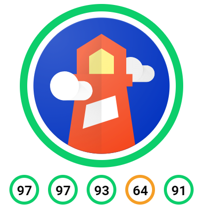

<h1 style="text-align:center"><b>Google Lighthouse FAB</b></h1>

<div style="margin:20px">
    
</div>

<p style="text-align:center;"><b>Showcase your app's performance with Google Lighthouse FAB.</b></p>

<p style="text-align:center;">A simple, easy-to-use react component.</p>

This is a Floating Access Button component for Google Lighthouse Reports.

It's intended for developers that want to highlight their web applications' performance scores.

## Demo

You can demo component via [storybook](https://competent-goldberg-06ad3c.netlify.app/).

## Get Started

Begin by installing the component via npm:
```
npm install react-google-lighthouse-fab
```
Once installed, import the component into your project:
```
import { LighthouseFab } from 'react-google-lighthouse-fab';
```
Once imported, pass the component a gistId (where your lighthouse report is hosted):
```
<LighthouseFab gistId={your_reports_gistId}/>
```

## Google Lighthouse Report

[Google Lighthouse](https://developers.google.com/web/tools/lighthouse)

## Google Lighthouse Viewer

[Google Lighthouse Viewer](https://googlechrome.github.io/lighthouse/viewer/)

## Storybook

[Storybook](https://competent-goldberg-06ad3c.netlify.app/)

## Documentation

[Docs]()

## Contribution

If you'd like to expand upon the component, please submit a PR (I'll almost certainly approve it).

## Authors

[Matthew E. Miller](https://www.matthewearlmiller.com) 

[JAMM Software Systems](https://www.jammsoftwaresystems.com)